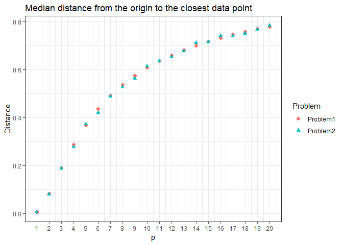

HW1
================
ceemooni
2019년 3월 18일

Problem1
========

``` r
myftn1 <- function(N,p) (1-(1/2)^(1/N))^(1/p)

myftn1(100,2)
```

    ## [1] 0.0831114

``` r
myftn1(100,8)
```

    ## [1] 0.5369269

Problem2
========

``` r
mygen1 <- function(N,p){
  
  direction <- matrix(rnorm(N*p),N,p) # X1,...,Xp ~ iid N(0,1)
  unit_direction <- direction/sqrt(rowSums(direction^2)) # Unit sphere
  
  U <- runif(N) # Generate random sample U1,...U_N ~ iid U(0,1)
  distance <- U^(1/p) # inverse CDF
  
  unif_pts <- unit_direction*distance  # *distance
  return(unif_pts) # Uniformly distributed N points
}
```

``` r
library(scatterplot3d)
library(tidyverse)
```

    ## -- Attaching packages ------------ tidyverse 1.2.1 --

    ## √ ggplot2 3.1.0     √ purrr   0.2.4
    ## √ tibble  1.4.2     √ dplyr   0.7.8
    ## √ tidyr   0.8.0     √ stringr 1.2.0
    ## √ readr   1.1.1     √ forcats 0.3.0

    ## -- Conflicts --------------- tidyverse_conflicts() --
    ## x dplyr::filter() masks stats::filter()
    ## x dplyr::lag()    masks stats::lag()

``` r
sample1 <- as.data.frame(mygen1(500,3))

scatterplot3d(sample1[,1], sample1[,2], sample1[,3], box = F,
              highlight.3d=F,
              col.grid="lightblue", main="N=500", pch=20, type = "p",
              xlab = "X1", ylab="X2", zlab="X3")
```


``` r
ggplot(sample1) + geom_point(aes(V1, V3)) + 
  theme_minimal() + xlab("X1") + ylab("X3") + ggtitle("N=500") + xlim(c(-1,1)) 
```


Problem3
========

``` r
myftn2 <- function(N,p,M) quantile(replicate(M, min(sqrt(rowSums(mygen1(N,p)^2)))), prob=0.5)[[1]]

mycompare <- function(N,p,M){as.data.frame(cbind(p=p, 
                                                 Problem1=sapply(p, myftn1, N=N), 
                                                 Problem2=sapply(p, myftn2, N=N, M=M)))}

mycompare(N=100,p=1:20,M=100) %>%
  gather(Problem, Distance, -p) %>% ggplot() + 
  geom_point(aes(x=p, y=Distance, color=Problem, shape=Problem), size=2) + 
  scale_x_continuous(breaks=1:20) +
  theme_bw() + ggtitle("Median distance from the origin to the closest data point")
```



``` r
mycompare(N=1000,p=c(3,8,15),M=100)
```

    ##    p   Problem1   Problem2
    ## 1  3 0.08848948 0.09360546
    ## 2  8 0.40279528 0.40659674
    ## 3 15 0.61571301 0.61621201
