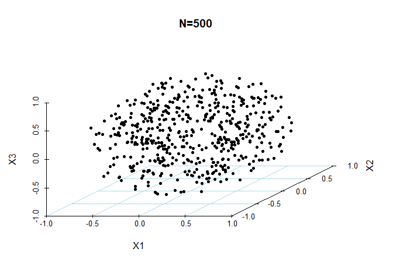
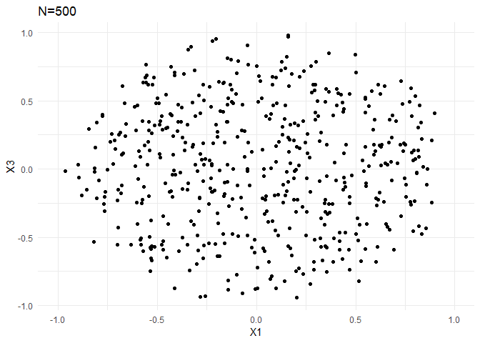

HW1
================
ceemooni
2019년 3월 18일

Problem1
========

``` r
myftn1 <- function(N,p) (1-(1/2)^(1/N))^(1/p)

myftn1(100,2)
```

    ## [1] 0.0831114

``` r
myftn1(100,8)
```

    ## [1] 0.5369269

Problem2
========

``` r
mygen1 <- function(N,p){
  
  direction <- matrix(rnorm(N*p),N,p) # X1,...,Xp ~ iid N(0,1)
  unit_direction <- direction/sqrt(rowSums(direction^2)) # Unit sphere
  
  U <- runif(N) # Generate random sample U1,...U_N ~ iid U(0,1)
  distance <- U^(1/p) # inverse CDF
  unif_pts <- unit_direction*distance  # *distance
  return(unif_pts) # Uniformly distributed N points
}
```

``` r
library(scatterplot3d)
library(ggplot2)
sample1 <- as.data.frame(mygen1(500,3))

scatterplot3d(sample1[,1], sample1[,2], sample1[,3], box = F,
              highlight.3d=F,
              col.grid="lightblue", main="N=5000", pch=20, type = "p",
              xlab = "X1", ylab="X2", zlab="X3")
```



``` r
ggplot(sample1) + geom_point(aes(V1, V3)) + 
  theme_minimal() + xlab("X1") + ylab("X3") + ggtitle("N=5005") + xlim(c(-1,1)) 
```



Problem3
========

``` r
myftn2 <- function(N,p,M){
  min_distance <- matrix(0,M,1)
  for(i in 1:M){
    unif_pts <- mygen1(N,p)
    min_distance[i] <- min(sqrt(rowSums(unif_pts^2))) 
  }
  return(median(min_distance))
}


myftn1(1000,4)
```

    ## [1] 0.162244

``` r
myftn2(1000,4,1000)
```

    ## [1] 0.167518
