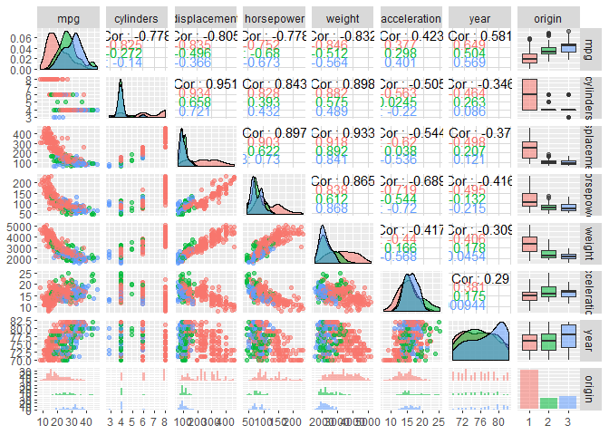
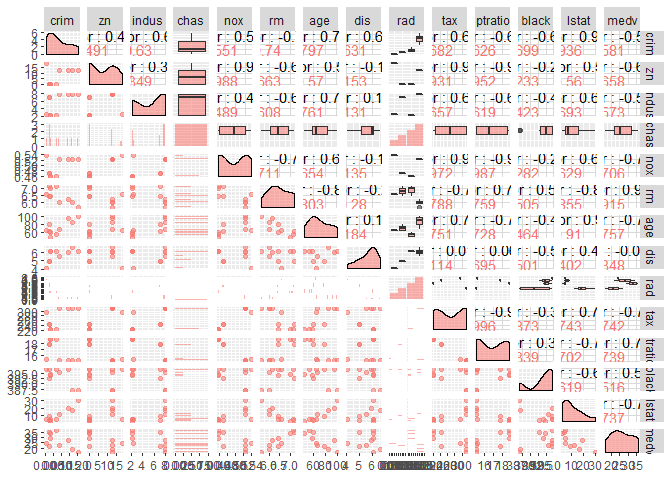
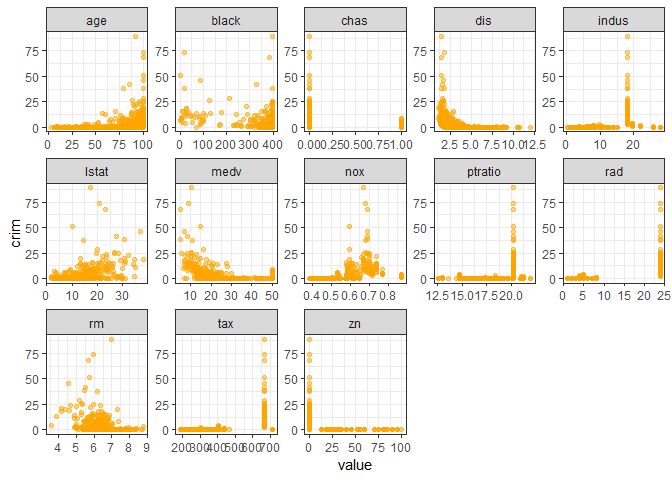
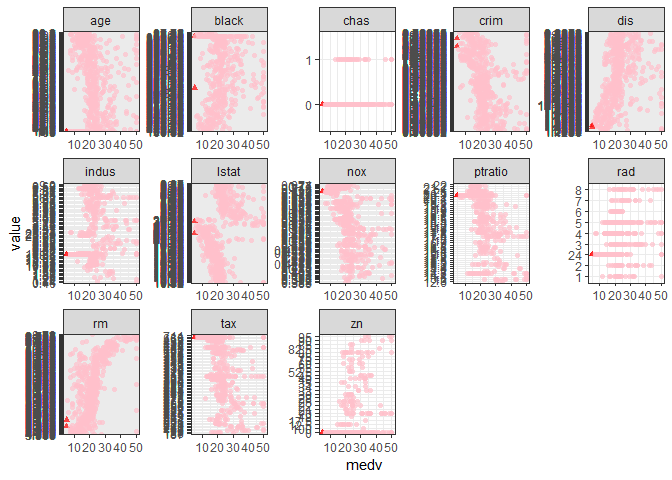
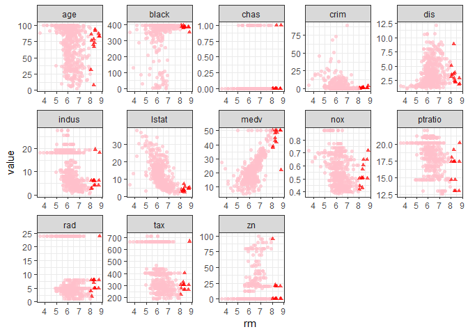

ISLR\_Ch2\_Exercise
================
ceemooni
2019년 3월 24일

``` r
library(tidyverse)
```

    ## -- Attaching packages -------------------------- tidyverse 1.2.1 --

    ## √ ggplot2 3.1.0     √ purrr   0.2.4
    ## √ tibble  1.4.2     √ dplyr   0.7.8
    ## √ tidyr   0.8.0     √ stringr 1.2.0
    ## √ readr   1.1.1     √ forcats 0.3.0

    ## -- Conflicts ----------------------------- tidyverse_conflicts() --
    ## x dplyr::filter() masks stats::filter()
    ## x dplyr::lag()    masks stats::lag()

Ex.9

``` r
?ISLR::Auto
```

    ## starting httpd help server ... done

``` r
Auto2 <- na.omit(ISLR::Auto)

str(Auto2)
```

    ## 'data.frame':    392 obs. of  9 variables:
    ##  $ mpg         : num  18 15 18 16 17 15 14 14 14 15 ...
    ##  $ cylinders   : num  8 8 8 8 8 8 8 8 8 8 ...
    ##  $ displacement: num  307 350 318 304 302 429 454 440 455 390 ...
    ##  $ horsepower  : num  130 165 150 150 140 198 220 215 225 190 ...
    ##  $ weight      : num  3504 3693 3436 3433 3449 ...
    ##  $ acceleration: num  12 11.5 11 12 10.5 10 9 8.5 10 8.5 ...
    ##  $ year        : num  70 70 70 70 70 70 70 70 70 70 ...
    ##  $ origin      : num  1 1 1 1 1 1 1 1 1 1 ...
    ##  $ name        : Factor w/ 304 levels "amc ambassador brougham",..: 49 36 231 14 161 141 54 223 241 2 ...

``` r
Auto2$origin <- as.factor(Auto2$origin)

sapply(Auto2[,1:7], range)
```

    ##       mpg cylinders displacement horsepower weight acceleration year
    ## [1,]  9.0         3           68         46   1613          8.0   70
    ## [2,] 46.6         8          455        230   5140         24.8   82

``` r
sapply(Auto2[,1:7], mean)
```

    ##          mpg    cylinders displacement   horsepower       weight 
    ##    23.445918     5.471939   194.411990   104.469388  2977.584184 
    ## acceleration         year 
    ##    15.541327    75.979592

``` r
sapply(Auto2[,1:7], sd)
```

    ##          mpg    cylinders displacement   horsepower       weight 
    ##     7.805007     1.705783   104.644004    38.491160   849.402560 
    ## acceleration         year 
    ##     2.758864     3.683737

``` r
Auto3 <- Auto2[-(10:85), ]
sapply(Auto3[,1:7], range)
```

    ##       mpg cylinders displacement horsepower weight acceleration year
    ## [1,] 11.0         3           68         46   1649          8.5   70
    ## [2,] 46.6         8          455        230   4997         24.8   82

``` r
sapply(Auto3[,1:7], mean)
```

    ##          mpg    cylinders displacement   horsepower       weight 
    ##    24.404430     5.373418   187.240506   100.721519  2935.971519 
    ## acceleration         year 
    ##    15.726899    77.145570

``` r
sapply(Auto3[,1:7], sd)
```

    ##          mpg    cylinders displacement   horsepower       weight 
    ##     7.867283     1.654179    99.678367    35.708853   811.300208 
    ## acceleration         year 
    ##     2.693721     3.106217

``` r
GGally::ggpairs(Auto2[,1:8], aes(color=origin, alpha=0.4))
```

    ## `stat_bin()` using `bins = 30`. Pick better value with `binwidth`.
    ## `stat_bin()` using `bins = 30`. Pick better value with `binwidth`.
    ## `stat_bin()` using `bins = 30`. Pick better value with `binwidth`.
    ## `stat_bin()` using `bins = 30`. Pick better value with `binwidth`.
    ## `stat_bin()` using `bins = 30`. Pick better value with `binwidth`.
    ## `stat_bin()` using `bins = 30`. Pick better value with `binwidth`.
    ## `stat_bin()` using `bins = 30`. Pick better value with `binwidth`.



Ex.10
-----

``` r
?MASS::BostonBoston
```

    ## No documentation for 'BostonBoston' in specified packages and libraries:
    ## you could try '??BostonBoston'

``` r
Boston <- MASS::Boston

nrow(Boston); ncol(Boston)
```

    ## [1] 506

    ## [1] 14

``` r
GGally::ggpairs(Boston, aes(color=factor(zn), alpha=0.4))
```



``` r
Boston %>% gather(key=variable, value=value, -crim) %>% 
  ggplot() + 
  geom_point(aes(x=value, y=crim), color="orange", alpha=0.5) + 
  facet_wrap(. ~ variable, scales = "free", nrow=3) + theme_bw()
```



``` r
cor(Boston, use="complete.obs")[1, ]
```

    ##        crim          zn       indus        chas         nox          rm 
    ##  1.00000000 -0.20046922  0.40658341 -0.05589158  0.42097171 -0.21924670 
    ##         age         dis         rad         tax     ptratio       black 
    ##  0.35273425 -0.37967009  0.62550515  0.58276431  0.28994558 -0.38506394 
    ##       lstat        medv 
    ##  0.45562148 -0.38830461

``` r
p1 <- Boston %>% mutate(id=1:nrow(Boston)) %>% 
  ggplot() + geom_point(aes(x=id, y=crim)) + theme_bw()
p2 <- Boston %>% mutate(id=1:nrow(Boston)) %>% 
  ggplot() + geom_point(aes(x=id, y=tax)) + theme_bw()
p3 <- Boston %>% mutate(id=1:nrow(Boston)) %>% 
  ggplot() + geom_point(aes(x=id, y=ptratio)) + theme_bw()
gridExtra::grid.arrange(p1, p2, p3, ncol=3)
```


``` r
table(Boston$chas)
```

    ## 
    ##   0   1 
    ## 471  35

``` r
median(Boston$ptratio)
```

    ## [1] 19.05

``` r
Boston %>% filter(medv==min(medv))      
```

    ##      crim zn indus chas   nox    rm age    dis rad tax ptratio  black
    ## 1 38.3518  0  18.1    0 0.693 5.453 100 1.4896  24 666    20.2 396.90
    ## 2 67.9208  0  18.1    0 0.693 5.683 100 1.4254  24 666    20.2 384.97
    ##   lstat medv
    ## 1 30.59    5
    ## 2 22.98    5

``` r
Boston %>% gather(key=variable, value=value, -medv) %>% 
  ggplot() + 
  geom_point(aes(x=medv, y=value, shape=as.factor(medv==5), color=as.factor(medv==5)), alpha=0.7) + 
  facet_wrap(. ~ variable, scales = "free", nrow=3) + 
  theme_bw() + theme(legend.position = "none") + 
  scale_color_manual(values=c("pink", "red"))
```



``` r
table(as.factor(Boston$rm > 7))
```

    ## 
    ## FALSE  TRUE 
    ##   442    64

``` r
table(as.factor(Boston$rm > 8))
```

    ## 
    ## FALSE  TRUE 
    ##   493    13

``` r
rbind(sapply(Boston[Boston$rm>8,], mean), sapply(Boston, median))
```

    ##           crim       zn    indus      chas       nox       rm      age
    ## [1,] 0.7187954 13.61538 7.078462 0.1538462 0.5392385 8.348538 71.53846
    ## [2,] 0.2565100  0.00000 9.690000 0.0000000 0.5380000 6.208500 77.50000
    ##           dis      rad      tax  ptratio    black lstat medv
    ## [1,] 3.430192 7.461538 325.0769 16.36154 385.2108  4.31 44.2
    ## [2,] 3.207450 5.000000 330.0000 19.05000 391.4400 11.36 21.2

``` r
Boston %>% gather(key=variable, value=value, -rm) %>% 
  ggplot() + 
  geom_point(aes(x=rm, y=value, shape=as.factor(rm>8), color=as.factor(rm>8)), alpha=0.7) + 
  facet_wrap(. ~ variable, scales = "free", nrow=3) + 
  theme_bw() + theme(legend.position = "none") + 
  scale_color_manual(values=c("pink", "red"))
```


