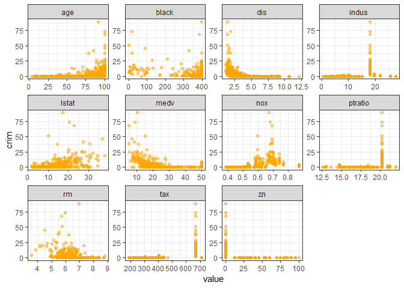

ISLR\_Ch2\_Exercise
================
ceemooni
2019년 3월 24일

``` r
library(tidyverse)
```

Ex.9

This exercise involves the Auto data set studied in the lab. Make sure that the missing values have been removed from the data.

1.  Which of the predictors are quantitative, and which are qualitative?

``` r
Auto2 <- na.omit(ISLR::Auto)

str(Auto2)
```

    ## 'data.frame':    392 obs. of  9 variables:
    ##  $ mpg         : num  18 15 18 16 17 15 14 14 14 15 ...
    ##  $ cylinders   : num  8 8 8 8 8 8 8 8 8 8 ...
    ##  $ displacement: num  307 350 318 304 302 429 454 440 455 390 ...
    ##  $ horsepower  : num  130 165 150 150 140 198 220 215 225 190 ...
    ##  $ weight      : num  3504 3693 3436 3433 3449 ...
    ##  $ acceleration: num  12 11.5 11 12 10.5 10 9 8.5 10 8.5 ...
    ##  $ year        : num  70 70 70 70 70 70 70 70 70 70 ...
    ##  $ origin      : num  1 1 1 1 1 1 1 1 1 1 ...
    ##  $ name        : Factor w/ 304 levels "amc ambassador brougham",..: 49 36 231 14 161 141 54 223 241 2 ...

``` r
Auto2$origin <- as.factor(Auto2$origin)
```

> Auto 데이터는 7개 quantitative predictors, 2개 qualitative predictors에 대해 392개 관측치로 이뤄진 데이터다. origin변수는 데이터 로딩 시number variable로 인식됐지만 자동차 생산 국가를 의미하는 categorical variable이므로 qualitative로 처리한다.

1.  What is the range of each quantitative predictor? You can answer this using the range() function.

``` r
sapply(Auto2[,1:7], range)
```

    ##       mpg cylinders displacement horsepower weight acceleration year
    ## [1,]  9.0         3           68         46   1613          8.0   70
    ## [2,] 46.6         8          455        230   5140         24.8   82

> Cylinders 변수의 설명에 의하면 4 이상 8이하 범위의 값만 가능한데, 데이터에서 최소값이 3이므로 outliers가 존재하는 것 같다. Mpg, displacement, horsepower, weight 등의 변수는 값의 범위가 상당히 큰 것으로 보아 여러 차종이 섞인 데이터인 것 같다. 따라서, 차종에 따라 데이터를 구분하여 분석할 수 있으면 좋을 것 같다.

1.  What is the mean and standard deviation of each quantitative predictor?

``` r
sapply(Auto2[,1:7], mean)
```

    ##          mpg    cylinders displacement   horsepower       weight 
    ##    23.445918     5.471939   194.411990   104.469388  2977.584184 
    ## acceleration         year 
    ##    15.541327    75.979592

``` r
sapply(Auto2[,1:7], sd)
```

    ##          mpg    cylinders displacement   horsepower       weight 
    ##     7.805007     1.705783   104.644004    38.491160   849.402560 
    ## acceleration         year 
    ##     2.758864     3.683737

> Standard deviaiton이 비교적 큰 변수는 Displacement, horsepower 등이 있고, 작은 변수는 year이다.

1.  Now remove the 10th through 85th observations. What is the range, mean, and standard deviation of each predictor in the subset of the data that remains?

``` r
Auto3 <- Auto2[-(10:85), ]
sapply(Auto3[,1:7], range)
```

    ##       mpg cylinders displacement horsepower weight acceleration year
    ## [1,] 11.0         3           68         46   1649          8.5   70
    ## [2,] 46.6         8          455        230   4997         24.8   82

``` r
sapply(Auto3[,1:7], mean)
```

    ##          mpg    cylinders displacement   horsepower       weight 
    ##    24.404430     5.373418   187.240506   100.721519  2935.971519 
    ## acceleration         year 
    ##    15.726899    77.145570

``` r
sapply(Auto3[,1:7], sd)
```

    ##          mpg    cylinders displacement   horsepower       weight 
    ##     7.867283     1.654179    99.678367    35.708853   811.300208 
    ## acceleration         year 
    ##     2.693721     3.106217

> 76개 관측치를 데이터에서 제거하여도 변수별 range나 mean, standard deviaition은 크게 변하지 않았다. 데이터가 order없이 고르게 분포한 것 같다.

1.  Using the full data set, investigate the predictors graphically, using scatterplots or other tools of your choice. Create some plots highlighting the relationships among the predictors. Comment on your findings.

``` r
GGally::ggpairs(Auto2[,1:8], aes(color=origin, alpha=0.4))
```


> Mpg 변수는 cylinders(-0.78), displacement(-0.81), horsepower(-0.78), weight(-0.83)와 음의 상관관계, cylinders 변수는 displacement(0.95), horsepower(0.84), weight(0.90)와 양의 상관관계, displacement 변수는 horsepower(0.90), weight변수(0.93)과 양의 상관관계, horsepower 변수는 weight(0.87)와 양의 상관관계가 있다. 서로 상관관계가 높은 변수가 많기 때문에 다중공선성을 의심해볼 필요가 있다. 또한, Categorical 변수인 Origin은 색깔을 통해 구분했는데, 각 변수의 density plot을 살펴보면 mpg, cylinders, displacement, weight 등에서 생산 국가별 차이가 두드러진다.

1.  Suppose that we wish to predict gas mileage (mpg) on the basis of the other variables. Do your plots suggest that any of the other variables might be useful in predicting mpg? Justify your answer.

> 위 그래프에서 mpg변수는 cylinders, displacement, horsepower, weight와 음의 상관관계를 가진 것으로 보인다. 따라서 이 변수들 중에서 예측변수를 채택하여 gas mileage 값을 예측할 수 있을 것 같다. 그런데 이 세 변수들 또한 서로 높은 상관관계를 보이므로 예측모형을 결정할 때 다중공선성을 주의하여 예측변수를 선택해야 한다.

Ex.10
-----

1.  To begin, load in the Boston data set. The Boston data set is part of the MASS library in R. How many rows are in this data set? How many columns? What do the rows and columns represent?

``` r
Boston <- MASS::Boston

nrow(Boston); ncol(Boston)
```

    ## [1] 506

    ## [1] 14

``` r
Boston <- Boston %>% mutate(chas=factor(chas), rad=factor(rad))
```

> Boston 데이터는 14개 quantitative predictors변수에 대해 506개 관측치로 이뤄진 데이터다. 506개의 관측치는 Boston지역 내 각 suburb에 대한 것이다. Chas와 rad는 categorical 변수로 처리했다.

1.  Make some pairwise scatterplots of the predictors (columns) in this data set. Describe your findings.

``` r
GGally::ggpairs(Boston, aes(color=factor(chas), alpha=0.4, 
                            params=list(corSize=3)))
```


> Correlation coefficient의 절댓값이 0.8보다 큰 경우는 없으며, 0.7보다 큰 경우는 다음과 같다. Indus는 nox(0.76), tax(0.72)와 양의 상관관계를 보이며, dis(-0.71)와 음의 상관관계를 보인다. Nox는 age(0.73)와 양의 상관관계, dis(-0.77)와 음의 상관관계를 보인다. Age는 dis(-0.75)와 음의 상관관계를 보이며, lstat은 medv(-0.74)와 음의 상관관계를 보인다. 이러한 상관관계는 모두 산점도 행렬로부터 확인 가능하다. 산점도로부터 몇 개의 outlier가 존재함을 확인할 수 있다.

1.  Are any of the predictors associated with per capita crime rate? If so, explain the relationship.

``` r
Boston[,-c(4,9)] %>% gather(key=variable, value=value, -crim) %>% 
  ggplot() + 
  geom_point(aes(x=value, y=crim), color="orange", alpha=0.5) + 
  facet_wrap(. ~ variable, scales = "free", nrow=3) + theme_bw()
```



``` r
crim_cor <- Boston %>% select(-chas, -rad) %>% cor(use="complete.obs")
crim_cor[1,]
```

    ##       crim         zn      indus        nox         rm        age 
    ##  1.0000000 -0.2004692  0.4065834  0.4209717 -0.2192467  0.3527343 
    ##        dis        tax    ptratio      black      lstat       medv 
    ## -0.3796701  0.5827643  0.2899456 -0.3850639  0.4556215 -0.3883046

> Crim 값이 높은 지역은 indus, ptratio, tax값이 높게 치중됐고, zn은 낮다. 또한 age가 높은 지역, dis가 낮은 지역 중에 crim이 높은 지역이 있는 것으로 보인다.

1.  Do any of the suburbs of Boston appear to have particularly high crime rates? Tax rates? Pupil-teacher ratios? Comment on the range of each predictor.

``` r
p1 <- Boston %>% mutate(id=1:nrow(Boston)) %>% 
  ggplot() + geom_point(aes(x=id, y=crim)) + theme_bw()
p2 <- Boston %>% mutate(id=1:nrow(Boston)) %>% 
  ggplot() + geom_point(aes(x=id, y=tax)) + theme_bw()
p3 <- Boston %>% mutate(id=1:nrow(Boston)) %>% 
  ggplot() + geom_point(aes(x=id, y=ptratio)) + theme_bw()
gridExtra::grid.arrange(p1, p2, p3, ncol=3)
```


> 350번째 이후 suburb들의 crim값 및 tax값이 높은 것으로 보인다. Ptratio는 지역별로 편차가 크게 존재한다고 보기 어렵다.

1.  How many of the suburbs in this data set bound the Charles river?

``` r
table(Boston$chas)
```

    ## 
    ##   0   1 
    ## 471  35

> 506개 sububs 중 35개가 Charlse river에 둘러싸여 있다.

1.  What is the median pupil-teacher ratio among the towns in this data set?

``` r
median(Boston$ptratio)
```

    ## [1] 19.05

> Pupil teacher ratio의 median은 19.05이다.

1.  Which suburb of Boston has lowest median value of owneroccupied homes? What are the values of the other predictors for that suburb, and how do those values compare to the overall ranges for those predictors? Comment on your findings.

``` r
Boston %>% filter(medv==min(medv))      
```

    ##      crim zn indus chas   nox    rm age    dis rad tax ptratio  black
    ## 1 38.3518  0  18.1    0 0.693 5.453 100 1.4896  24 666    20.2 396.90
    ## 2 67.9208  0  18.1    0 0.693 5.683 100 1.4254  24 666    20.2 384.97
    ##   lstat medv
    ## 1 30.59    5
    ## 2 22.98    5

``` r
Boston[,-c(4,9)] %>% gather(key=variable, value=value, -medv) %>% 
  ggplot() + 
  geom_point(aes(x=medv, y=value, shape=as.factor(medv==5), color=as.factor(medv==5)), alpha=0.7) + 
  facet_wrap(. ~ variable, scales = "free", nrow=3) + 
  theme_bw() + theme(legend.position = "none") + 
  scale_color_manual(values=c("pink", "red"))
```


> Median value of owneroccupied homes(medv)이 가장 작은 지역은 두 곳이며, 각각 값이 5이다. 해당 지역의 특징을 살펴보기 위해 다른 변수들과 medv간 산점도를 그린 후 두 지역에 대한 점을 진하게 표시했다. 해당 지역은 age, black, tax가 다른 지역에 비해 높으며 dis, zn 값이 낮다.

1.  In this data set, how many of the suburbs average more than seven rooms per dwelling? More than eight rooms per dwelling? Comment on the suburbs that average more than eight rooms per dwelling.

``` r
table(as.factor(Boston$rm > 7))
```

    ## 
    ## FALSE  TRUE 
    ##   442    64

``` r
table(as.factor(Boston$rm > 8))
```

    ## 
    ## FALSE  TRUE 
    ##   493    13

``` r
rbind(sapply(Boston[Boston$rm>8,-c(4,9)], mean), 
      sapply(Boston[,-c(4,9)], median))
```

    ##           crim       zn    indus       nox       rm      age      dis
    ## [1,] 0.7187954 13.61538 7.078462 0.5392385 8.348538 71.53846 3.430192
    ## [2,] 0.2565100  0.00000 9.690000 0.5380000 6.208500 77.50000 3.207450
    ##           tax  ptratio    black lstat medv
    ## [1,] 325.0769 16.36154 385.2108  4.31 44.2
    ## [2,] 330.0000 19.05000 391.4400 11.36 21.2

> 평균 방 개수가 7개보다 많은 지역은 64개, 8개보다 많은 지역은 13개이다.

``` r
Boston %>% gather(key=variable, value=value, -rm) %>% 
  ggplot() + 
  geom_point(aes(x=rm, y=value, shape=as.factor(rm>8), color=as.factor(rm>8)), alpha=0.7) + 
  facet_wrap(. ~ variable, scales = "free", nrow=3) + 
  theme_bw() + theme(legend.position = "none") + 
  scale_color_manual(values=c("pink", "red"))
```


> 평균 방 개수가 8개보다 많은 지역의 특징을 살펴보기 위해 다른 변수들과 rm간 산점도를 그린 후 해당 13개 지역의 점을 진하게 표시했다. 이 지역들은 대부분 Black, medv가 높고 crim, lstat이 작다.
