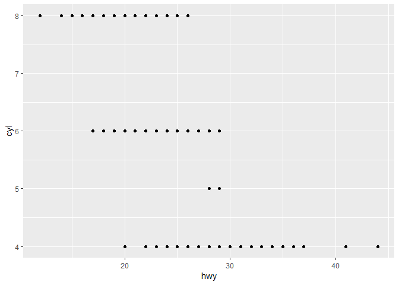
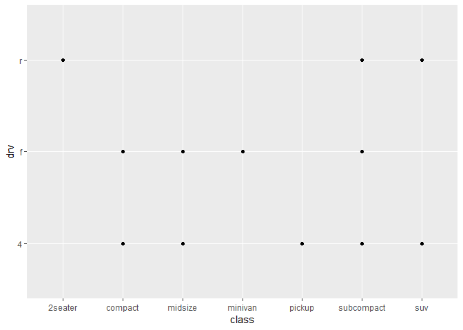
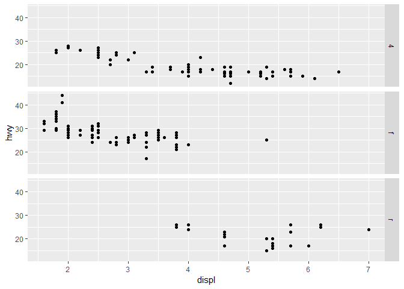
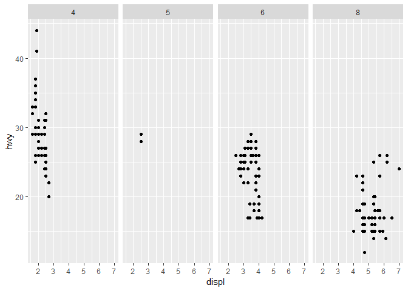
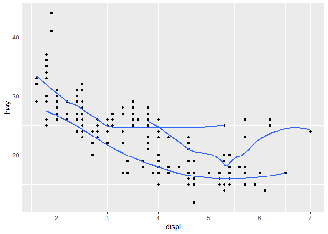
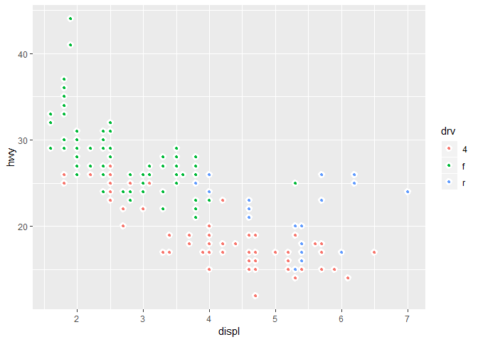

통계그래픽스\_HW1
================
ceemooni
2019년 3월 11일

``` r
library(tidyverse)
```

1. Make a scatterplot of hwy vs cyl.
------------------------------------

``` r
ggplot(data=mpg) + geom_point(aes(x=hwy, y=cyl))
```



2. What happens if you make a scatterplot of class vs drv. Why is the plot not useful?
--------------------------------------------------------------------------------------

``` r
ggplot(data=mpg) + geom_point(aes(x=class, y=drv))
```



두 범주형 변수에 대한 산점도를 그렸기 때문에, x와 y값이 모두 동일한 경우 모두 한 점에 그려지게 된다. 위 그래프에서는 특정 범주에 해당하는 관측치의 유무정도만 파악할 수 있으며, 어떤 범주에 많은 점이 찍히는지 등 관측치의 분포를 보기 위해 그래프를 수정하는 것이 좋다.

3. What's gone wrong with this code? Why are the points not blue?
-----------------------------------------------------------------

``` r
ggplot(data = mpg) +
  geom_point(mapping = aes(x = displ, y = hwy, color = "blue"))
```


mapping에서 입력되면 변수로 인식하기 때문에 "blue"를 파랑색으로 인식하는 대신, 변수값이 관측치에 따라 구분되지 않은 새로운 변수로 인식한다. 따라서 모든 점이 default(여기서는 주황) 색으로 동일하게 정해진다. 모든 점에 대해 특정 색을 지정하고 싶다면 mapping 바깥에서 지정해야만 색깔명으로 인식한다.

``` r
ggplot(data = mpg) +
  geom_point(mapping = aes(x = displ, y = hwy), color = "blue")
```


4. What plots does the following code make? What does `.` do?
-------------------------------------------------------------

``` r
ggplot(data = mpg) +
  geom_point(mapping = aes(x = displ, y = hwy)) + facet_grid(drv ~ .)
```



``` r
ggplot(data = mpg) +
  geom_point(mapping = aes(x = displ, y = hwy)) + facet_grid(. ~ cyl)
```



geom\_point의 mapping대로 x축은 displ, y축은 hwy에 대해 산점도를 그린다. 이때, 첫번째 그래프는 drv의 범주(4,f,r)에 따라 수직방향에 대해 구분된 그래프를 그리며, 수평방향 축을 공유하기 때문에 x축인 displ변수의 값을 drv 값에 따라 비교해볼 수 있다. 두번째 그래프는 cyl의 범주(4,5,6,8)에 따라 수평방향으로 구분된 그래프를 그리며, 수직방향 축을 공유하기 때문에 y축인 hwy변수 값을 cyl 값에 따라 비교해볼 수 있다. '.'을 통해 해당 축에 대해서는 범주를 구분하지 않고 한꺼번에 그리도록 했다.

5. Will these two graphs look different? Why/why not?
-----------------------------------------------------

``` r
ggplot(data = mpg, mapping = aes(x = displ, y = hwy)) +
  geom_point() + geom_smooth()
```

    ## `geom_smooth()` using method = 'loess' and formula 'y ~ x'


``` r
ggplot() +
  geom_point(data = mpg, mapping = aes(x = displ, y = hwy)) +
  geom_smooth(data = mpg, mapping = aes(x = displ, y = hwy))
```

    ## `geom_smooth()` using method = 'loess' and formula 'y ~ x'


두 그래프가 다르지 않다. ggplot에서 maaping을 지정하면, 뒤따르는 geom\_point, geom\_smooth의 mapping도 동시에 정해지기 때문에 각각에서 지정했을 때 그려지는 그래프와 동일하게 그려진다.

6. Recreate the R code necessary to generate the following graphs.
------------------------------------------------------------------

``` r
ggplot(data = mpg, aes(x=displ, y=hwy)) +
  geom_point() + geom_smooth(aes(group=drv), se = F)
```

    ## `geom_smooth()` using method = 'loess' and formula 'y ~ x'



``` r
ggplot(data = mpg, aes(x = displ, y = hwy)) + 
  geom_point(aes(fill=drv), shape = 21, color = "white", stroke = 2)
```


