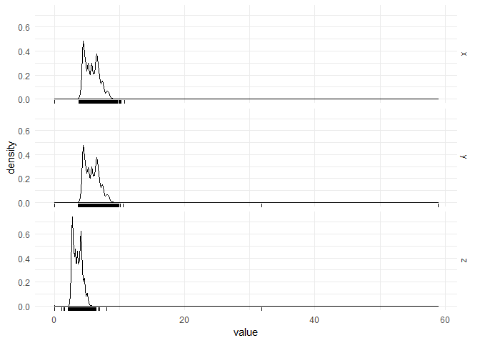
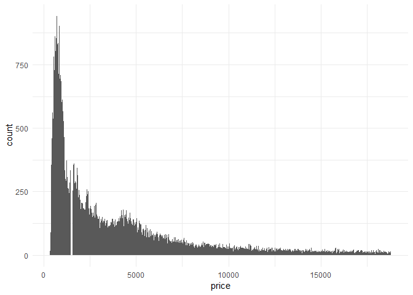
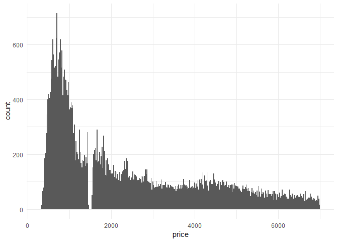
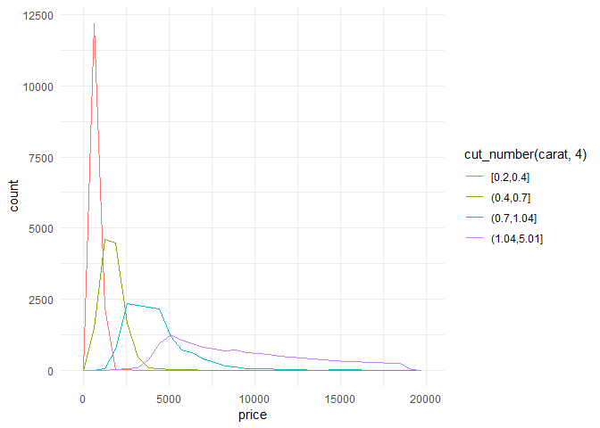
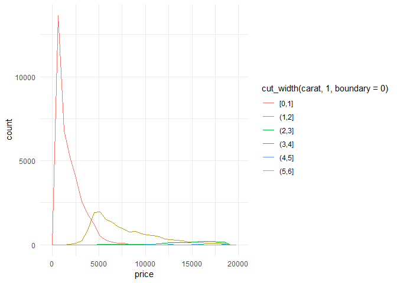
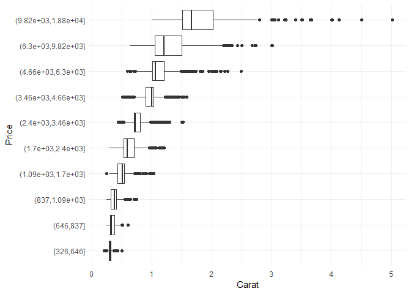
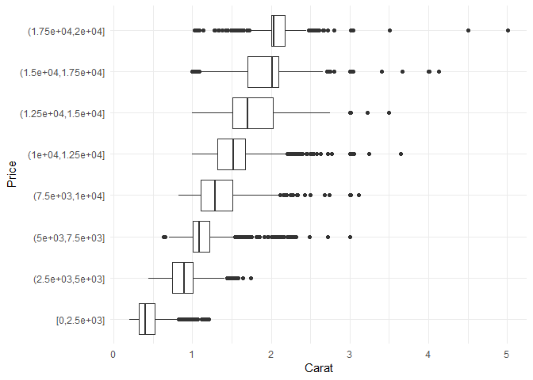

통계그래픽스 HW \#2
================
ceemooni
2019년 3월 18일

``` r
library(tidyverse)
```

-   Use diamonds data

1.  Explore the distribution of each the 'x', 'y', and 'z' variables in 'diamonds'. What do you learn? Think about a diamond and how you might decide which dimension is the length, width, and depth.

``` r
diamonds %>% 
  select(x, y, z) %>% 
  mutate(id=row_number()) %>% 
  gather(-'id', key = "key", value = "value") %>% 
  ggplot(aes(x=value)) + geom_density() + geom_rug() + 
  facet_grid(key ~ .) + 
  theme_minimal()
```



x, y, z 모두 right skewed된 분포를 보이므로 작은 크기의 다이아몬드가 대체로 더 많은 것으로 보이며, peak가 여러개 존재하는 것으로 보아 특히 많이 생산되는 크기가 있을 것 같다.

y와 z는 outlier가 존재한다.

보통 긴 쪽을 length(길이), 짧은 쪽을 width(폭)라고 한다. 다이아몬드 모양 상 depth가 length, width보다 짧고, length와 width는 거의 비슷할 것으로 예상된다. 따라서, 대체로 짧은 z가 depth이고 x, y에서 length, width가 있을 것으로 생각된다.

1.  Explore the distribution of 'price'. Do you discover anything unusual or surprising? (Hint: Carefully think about the 'binwidth' and make sure you try a wide range of values.)

``` r
diamonds %>% 
  ggplot() + geom_histogram(aes(x=price), binwidth = 30) + 
  theme_minimal()
```



``` r
diamonds %>% 
  filter(price<7000) %>% 
  ggplot() + geom_histogram(aes(x=price), binwidth = 20) + 
  theme_minimal()
```

    ## Warning: package 'bindrcpp' was built under R version 3.4.4



price는 매우 심하게 right skewed되었다.

가격이 $1500 부근인 다이아몬드는 데이터에 존재하지 않았고, $1000보다 낮은 가격의 다이아몬드가 많은 것으로 보인다.

$4000 근처에서, $4000보다 조금 높은 가격의 다이아몬드가 $4000보다 조금 낮은 가격인 것보다 더 많았다.

1.  How many diamonds are 0.99 carat? How many are 1 carat? What do you think is the cause of the difference?

``` r
diamonds %>% 
  filter(carat>=0.99, carat<=1) %>% 
  count(carat)
```

    ## # A tibble: 2 x 2
    ##   carat     n
    ##   <dbl> <int>
    ## 1 0.990    23
    ## 2 1.00   1558

다이아몬드 제조 시 판매량이 많은 사이즈를 주로 생산할 것이므로, 1캐럿 판매량이 많아 제조가 많이 된 것으로 생각된다.

1.  Instead of summarising the conditional distribution with a boxplot, you could use a frequency polygon. What do you need to consider when using 'cut\_width()' vs 'cut\_number()'? How does that impact a visualisation of the 2d distribution of 'carat' and 'price'?

``` r
diamonds %>% 
  ggplot(aes(x=price, color=cut_number(carat, 4))) +
  geom_freqpoly() + 
  theme_minimal()
```

    ## `stat_bin()` using `bins = 30`. Pick better value with `binwidth`.



``` r
diamonds %>% 
  ggplot(aes(x=price, color=cut_width(carat, 1, boundary = 0))) +
  geom_freqpoly() + 
  theme_minimal()
```

    ## `stat_bin()` using `bins = 30`. Pick better value with `binwidth`.



cut\_width()를 사용하면 해당 변수 값에 따라 분리하고, 값의 간격은 동일하게 지정한다. boundary 옵션을 이용해 시작점을 정할 수 있다. cut\_number()를 사용하면 구분되는 bin 개수를 지정하되, 각 bin 당 동일한 수의 관측치가 들어가게 분리한다.

두 방법 모두 각 bin별 분포 양상을 파악할 수 있다. cut\_width()는 어떤 bin에 많은 관측치가 분포하는지 알 수 있고, 관측치가 많은 구간의 분포는 알아보기 쉽지만 관측치가 거의 없는 구간은 뚜렷한 분포를 보기 어렵다. cut\_number()는 동일한 개수에 따라 구분하므로 분위가 달라짐에 따라 분포는 어떻게 변화하는지 확인하기에 좋다.

cut\_number(carat, 4)에 의해 carat을 4분위로 나눠 각 분위별 price 분포를 그렸다. 0.2~0.4캐럿 다이아몬드가 carat변수에 대해 1분위에 속하고, 가격이 매우 낮게 분포됐다는 사실을 쉽게 알아볼 수 있다.

다이아몬드 가격 분포를 캐럿에 따라 구분해봄으로써, 캐럿이 가격에 어떻게 영향을 주는지 판단할 수 있다.

1.  Visualise the distribution of carat, partitioned by price.

``` r
diamonds %>% 
  ggplot(aes(x=cut_number(price,10), y=carat)) + geom_boxplot() +
  xlab("Price") + ylab("Carat") +
  coord_flip() + 
  theme_minimal()
```



``` r
diamonds %>% 
  ggplot(aes(x=cut_width(price,2500, boundary = 0), y=carat)) + geom_boxplot() +
  xlab("Price") + ylab("Carat") +
  coord_flip() + 
  theme_minimal()
```



1.  How does the price distribution of very large diamonds compare to small diamonds. Is it as you expect, or does it suprise you?

1캐럿 이하인 다이아몬드는 대부분 $6,000보다 낮은 가격이다. 1캐럿보다는 큰 사이즈에서 높은 가격의 다이아몬드가 등장하기 시작하는 것으로 보인다. 1~3캐럿 다이아몬드에서 가격 분포가 가장 넓게 형성됐고, 3캐럿보다 큰 사이즈의 다이아몬드 가격은 주로 $12,000보다 높게 분포한다.

캐럿에 따른 가격 분포가 타당한 것으로 생각된다. 다이아몬드 가격은 사이즈의 영향을 많이 받으므로, 작은 사이즈는 높은 가격으로 판매되기 어렵다. 낮은 가격에 판매되는 상품은 가격 경쟁력이 중요하기 떄문에 브랜드나 디자인 등 다른 요소로 인한 가격 상승이 어렵다. 반면, 사이즈가 크면 높은 가격에 판매하는 것이 가능하다. 높은 가격에 구매하는 고객은 가격보다 상품의 질이나 브랜드가치에 대한 추가적인 금액도 지불할 용의가 있을 가능성이 크기 때문에, 이러한 수요를 만족하는 높은 가격의 다이아몬드가 생산될 것이다.

-   use table1, table2, table3, table4a and table4b data

1.  Compute the 'rate' for 'table2', and 'table4a' + 'table4b'. You will need to perform four operations:

<!-- -->

1.  Extract the number of TB cases per country per year.
2.  Extract the matching population per country per year.
3.  Divide cases by population, and multiply by 10000.
4.  Store back in the appropriate place.

\#\#\# table2

``` r
table2_rate <- table2 %>% spread(key="type", value="count") %>% 
  mutate(rate=cases/population*10000) %>% 
  gather(key="type", value="count", -"country", -"year", convert = TRUE) %>% 
  arrange(country, year)
table2_rate
```

    ## # A tibble: 18 x 4
    ##    country      year type                count
    ##    <chr>       <int> <chr>               <dbl>
    ##  1 Afghanistan  1999 cases             745    
    ##  2 Afghanistan  1999 population   19987071    
    ##  3 Afghanistan  1999 rate                0.373
    ##  4 Afghanistan  2000 cases            2666    
    ##  5 Afghanistan  2000 population   20595360    
    ##  6 Afghanistan  2000 rate                1.29 
    ##  7 Brazil       1999 cases           37737    
    ##  8 Brazil       1999 population  172006362    
    ##  9 Brazil       1999 rate                2.19 
    ## 10 Brazil       2000 cases           80488    
    ## 11 Brazil       2000 population  174504898    
    ## 12 Brazil       2000 rate                4.61 
    ## 13 China        1999 cases          212258    
    ## 14 China        1999 population 1272915272    
    ## 15 China        1999 rate                1.67 
    ## 16 China        2000 cases          213766    
    ## 17 China        2000 population 1280428583    
    ## 18 China        2000 rate                1.67

\#\#\# table4a+table4b

``` r
table4c <- left_join(table4a, table4b, by="country") %>% 
  rename(case99="1999.x", case00="2000.x", 
         popn99="1999.y", popn00="2000.y") %>% 
  mutate(rate99=case99/popn99*10000, 
         rate00=case00/popn00*10000) %>% 
  select(country, rate99, rate00) %>% 
  rename("1999"=rate99, "2000"=rate00)
table4c
```

    ## # A tibble: 3 x 3
    ##   country     `1999` `2000`
    ##   <chr>        <dbl>  <dbl>
    ## 1 Afghanistan  0.373   1.29
    ## 2 Brazil       2.19    4.61
    ## 3 China        1.67    1.67

table4a+table4b를 이용하는 방법이 변수명을 가지고 계산해야 해서 조금 복잡했다.

1.  Why are 'gather()' and 'spread()' not perfectly symmetrical? Carefully consdier the following exmpale: (Hint: look at the variable types and think about column *names*.) Both 'spread()' and 'gather()' have a 'convert' argument. What does it do?

``` r
stocks <- tibble(
  year = c(2015, 2015, 2016, 2016),
  half = c(1, 2, 1, 2),
  return = c(1.88, 0.59, 0.92, 0.17)
)
stocks
```

    ## # A tibble: 4 x 3
    ##    year  half return
    ##   <dbl> <dbl>  <dbl>
    ## 1  2015  1.00  1.88 
    ## 2  2015  2.00  0.590
    ## 3  2016  1.00  0.920
    ## 4  2016  2.00  0.170

``` r
stocks %>% 
  spread(year, return) %>%
  gather("year", "return", '2015':'2016')
```

    ## # A tibble: 4 x 3
    ##    half year  return
    ##   <dbl> <chr>  <dbl>
    ## 1  1.00 2015   1.88 
    ## 2  2.00 2015   0.590
    ## 3  1.00 2016   0.920
    ## 4  2.00 2016   0.170

``` r
stocks %>% 
  spread(year, return)
```

    ## # A tibble: 2 x 3
    ##    half `2015` `2016`
    ##   <dbl>  <dbl>  <dbl>
    ## 1  1.00  1.88   0.920
    ## 2  2.00  0.590  0.170

``` r
stocks %>% 
  spread(year, return) %>%
  gather("year", "return", '2015':'2016', convert = TRUE)
```

    ## # A tibble: 4 x 3
    ##    half  year return
    ##   <dbl> <int>  <dbl>
    ## 1  1.00  2015  1.88 
    ## 2  2.00  2015  0.590
    ## 3  1.00  2016  0.920
    ## 4  2.00  2016  0.170

기존 year변수의 타입은 double인데 spread와 gather를 거치면서 character가 되었다. 각 단계를 살펴본 결과, gather단계에서 character변수가 된 것을 확인했다. 따라서, 적절한 변수타입을 지정해주는 convert 옵션을 gather에서 사용하면 된다. year변수에 맞게 integer 타입을 지정해준 것을 볼 수 있다.

1.  Tidy the simple tibble below. Do you need to spread or gather it? What are the variables?

``` r
preg <- tribble(
  ~pregnant, ~male, ~female, 
  "yes", NA, 10,
  "no", 20, 12
)
preg
```

    ## # A tibble: 2 x 3
    ##   pregnant  male female
    ##   <chr>    <dbl>  <dbl>
    ## 1 yes       NA     10.0
    ## 2 no        20.0   12.0

``` r
(preg2 <- preg %>% gather(-pregnant, key="gender", value="count", na.rm=TRUE))
```

    ## # A tibble: 3 x 3
    ##   pregnant gender count
    ## * <chr>    <chr>  <dbl>
    ## 1 no       male    20.0
    ## 2 yes      female  10.0
    ## 3 no       female  12.0

``` r
preg3 <- preg2 %>%
  mutate(
    female = (gender == "female"),
    pregnant = (pregnant == "yes")
  ) %>%
  select(-gender)
preg3
```

    ## # A tibble: 3 x 3
    ##   pregnant count female
    ##   <lgl>    <dbl> <lgl> 
    ## 1 F         20.0 F     
    ## 2 T         10.0 T     
    ## 3 F         12.0 T

``` r
filter(preg2, gender=="female", pregnant=="no")
```

    ## # A tibble: 1 x 3
    ##   pregnant gender count
    ##   <chr>    <chr>  <dbl>
    ## 1 no       female  12.0

``` r
filter(preg2, gender=="female", pregnant=="yes")
```

    ## # A tibble: 1 x 3
    ##   pregnant gender count
    ##   <chr>    <chr>  <dbl>
    ## 1 yes      female  10.0

성별 변수로 묶이지 않고 남/녀 따로 칼럼이 분리돼있으므로 gather를 이용해서 단순하게 표현할 수 있다. 또한, 여성인지를 기준으로 T/F로 나눌 수 있으며, 여성인 관측치만 출력하여 임신여부를 기준으로 표를 추출할 수 있다.
